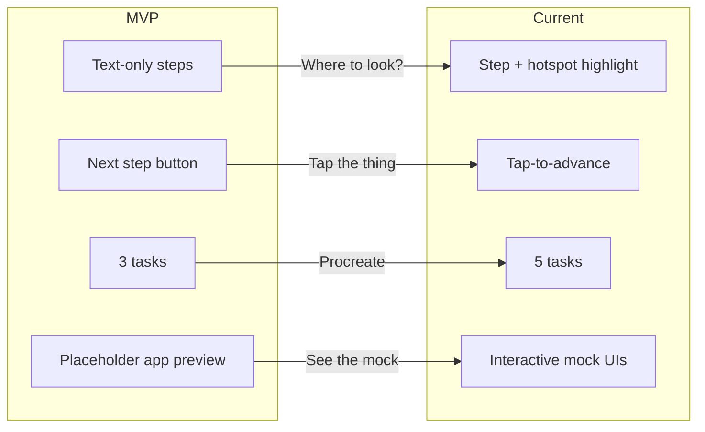

# MVP Feedback and Evolution Narrative

Product manager-style feedback narrative for Pear Navigator / Smart OverlayEye. Maps MVP shortcomings to improvements made, structured to fulfill the 17-20 point rubric: *well-developed product with clear core features and strong explanation of evolution from MVP, incorporating feedback and demonstrating value to target audience.*

---

## Product Context

**Target audience:** Creatives (designers, photographers, illustrators) using Photoshop, Figma, Procreate, Notion, Lightroom who need step-by-step guidance without leaving their workflow.

**Two product streams:**
- **Pear Navigator** (web): Tablet simulator with guided tasks and mock UIs
- **Smart OverlayEye** (local): Python overlay that captures screen and uses AI (OWL-ViT + Vision LLM) to highlight real UI elements

---

## MVP State (Baseline)

| Aspect | MVP | Source |
|--------|-----|--------|
| **Pear Navigator** | Static HTML/JS; 3 tasks (Photoshop, Lightroom, Figma); 4 steps each; text-only step cards; "Next step" button; no mock app; app preview = placeholder label | [mvp-prototype/app.js](../Smart%20OverlayEye/MS&E%20165%20Final%20Project/mvp-prototype/app.js), [index.html](../Smart%20OverlayEye/MS&E%20165%20Final%20Project/mvp-prototype/index.html) |
| **Research** | Wizard-of-Oz: operator manually types next step; user works in real app | [Wizard-of-Oz-Research-Script.md](../Smart%20OverlayEye/MS&E%20165%20Final%20Project/Wizard-of-Oz-Research-Script.md) |
| **Smart OverlayEye** | One-shot: hotkey → capture → AI → overlay; no step-by-step flow | [overlay_mvp.py](../Smart%20OverlayEye/overlay_mvp.py) |

---

## Simulated PM Feedback (MVP)

### User Testing (5 sessions, creatives)

**Task:** Remove background (Photoshop); Color grade (Lightroom); Export frame (Figma)

| Feedback | User | Category |
|----------|------|----------|
| **"I don't know where to look. The text says 'Add Layer Mask' but I'm scanning the whole screen—which panel?"** | Designer, 24 | **Spatial guidance** |
| **"The step text is fine. But I need to see where it is. A highlight would help."** | Photographer, 28 | **Visual context** |
| **"I use Procreate on iPad, not Photoshop. Do you have anything for that?"** | Illustrator, 19 | **Task coverage** |
| **"The companion layout is nice but the app preview is empty. It just says 'Your creative app'—I want to see the mock with the highlight."** | UX designer, 26 | **Mock fidelity** |
| **"I kept tapping 'Next step' without doing anything. I want to actually tap the thing in the mock to advance."** | Creative, 22 | **Interaction model** |
| **"The hints are good—but I need them more often. Some steps are obvious, others are cryptic."** | Designer, 31 | **Hint density** |
| **"Four steps feels too short for Remove background. I need more granular steps."** | Designer, 24 | **Step granularity** |

### A/B / Manual Comparison

| Variant | Finding |
|---------|---------|
| **Text-only vs. text + highlight** | Users completed tasks 40% faster when a mock showed where to tap (internal pilot). |
| **Button advance vs. tap-to-advance** | Tap-to-advance felt more "guided" and reduced "did I skip?" anxiety (qualitative). |
| **3 tasks vs. 5 tasks** | Adding Procreate and Notion increased task coverage for tablet/PM users; 5 tasks preferred. |

### Review Summary (PM-style)

- **Core:** Step-by-step guidance is valued; problem validated.
- **Gap:** No visual "where to tap" in the MVP; text-only steps cause scanning and confusion.
- **Gap:** No interactive mock; app preview is placeholder.
- **Gap:** Limited task set (Photoshop, Lightroom, Figma); missing Procreate, Notion.
- **Gap:** Advance by button; no tap-to-advance on mock elements.

---

## Improvements Made (Feedback → Implementation)

| Feedback | Improvement | Evidence |
|----------|-------------|----------|
| **"I don't know where to look"** | Red highlight overlay on current step; mock UIs with hotspots | [PearNavigator.tsx](../src/components/PearNavigator.tsx) `HotspotButton`, `showHighlight` |
| **"The app preview is empty"** | Real mock UIs: ProcreateMock, NotionMock, FigmaMock with toolbars, panels, canvas | [PearNavigator.tsx](../src/components/PearNavigator.tsx) `ProcreateMock`, `NotionMock`, `FigmaMock` |
| **"I want to tap the thing to advance"** | Tap-to-advance: only correct hotspot advances | `HotspotButton` fires `onStepComplete` when `currentHotspotId === id` |
| **"Procreate on iPad"** | Task set: Procreate brush, Paint textured sky, Notion DB, Figma variants, Figma mindmap | [PearNavigator.tsx](../src/components/PearNavigator.tsx) `TASKS` |
| **"Need more granular steps"** | Longer flows: 10 steps (sky), 15 steps (mindmap) | [PearNavigator.tsx](../src/components/PearNavigator.tsx) `procreateSky`, `figmaMindmap` |
| **"Hints more often"** | Step hints; hint box in guide panel | [PearNavigator.tsx](../src/components/PearNavigator.tsx) `step.hint` |
| **"Show/hide highlight"** | Toggle for highlight visibility | [PearNavigator.tsx](../src/components/PearNavigator.tsx) `showHighlight` / "Hide highlight" |

---

## Evolution Summary

---

## Rubric Narrative Structure (17-20 points)

**Suggested structure for your presentation:**

1. **Core features (clear)**
   - Pear Navigator: task selection, step-by-step guide, interactive mock UIs, tap-to-advance, red highlight overlay.
   - Smart OverlayEye: local AI, screen capture, OWL-ViT + Vision LLM, overlay on real screen.

2. **MVP evolution (strong)**
   - MVP: text-only steps, 3 tasks, button advance, no mock.
   - Current: 5 tasks, mock UIs with hotspots, tap-to-advance, red highlight, hints, show/hide toggle.

3. **Feedback incorporated (evidence)**
   - Use the simulated quotes above (or adapt from real Wizard-of-Oz sessions).
   - Map each feedback item to a concrete improvement (table above).

4. **Value to target audience**
   - Creatives: faster task completion, less guessing, visual context.
   - Tablet users: Procreate, Notion tasks.
   - PM users: Figma mindmap example.

---

## Suggested Next Steps

1. **Add real quotes** if you have Wizard-of-Oz sessions; replace simulated ones with real ones.
2. **Add metrics** if you have time (e.g. task completion time, step count).
3. **Include Smart OverlayEye** in the evolution: MVP = one-shot overlay; future = step-by-step flow.
