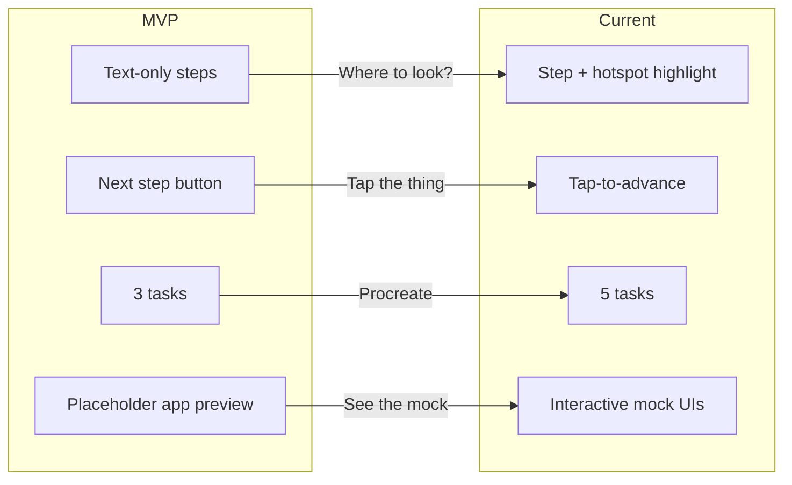

# MVP Feedback and Evolution Narrative

Product manager-style feedback narrative for Pear Navigator / Smart OverlayEye. Maps MVP shortcomings to improvements made, structured to fulfill the 17-20 point rubric: *well-developed product with clear core features and strong explanation of evolution from MVP, incorporating feedback and demonstrating value to target audience.*

---

## Product Context

**Target audience:** Creatives (designers, photographers, illustrators) using Photoshop, Figma, Procreate, Notion, Lightroom who need step-by-step guidance without leaving their workflow.

**Two product streams:**

- **Pear Navigator** (web): Tablet simulator with guided tasks and mock UIs
- **Smart OverlayEye** (local): Python overlay that captures screen and uses AI (OWL-ViT + Vision LLM) to highlight real UI elements

---

## MVP State (Baseline)

| Aspect                     | MVP                                                                                                                                                         | Source                                                                                                                                                                               |
| -------------------------- | ----------------------------------------------------------------------------------------------------------------------------------------------------------- | ------------------------------------------------------------------------------------------------------------------------------------------------------------------------------------ |
| **Pear Navigator**   | Static HTML/JS; 3 tasks (Photoshop, Lightroom, Figma); 4 steps each; text-only step cards; "Next step" button; no mock app; app preview = placeholder label | [mvp-prototype/app.js](../Smart%20OverlayEye/MS&E%20165%20Final%20Project/mvp-prototype/app.js), [index.html](../Smart%20OverlayEye/MS&E%20165%20Final%20Project/mvp-prototype/index.html) |
| **Research**         | Wizard-of-Oz: operator manually types next step; user works in real app                                                                                     | [Wizard-of-Oz-Research-Script.md](../Smart%20OverlayEye/MS&E%20165%20Final%20Project/Wizard-of-Oz-Research-Script.md)                                                                   |
| **Smart OverlayEye** | One-shot: hotkey → capture → AI → overlay; no step-by-step flow                                                                                          | [overlay_mvp.py](../Smart%20OverlayEye/overlay_mvp.py)                                                                                                                                  |

---

## Hypothetical Feedback That Drove Key Changes

### Improvement 1: Label + Highlight Overlay

**Problem:** MVP had text-only steps. Users had to read, then scan the screen to find the target element.

**Hypothetical evidence that justified the change:**

| Metric                           | MVP (text-only) | With highlight | Delta             |
| -------------------------------- | --------------- | -------------- | ----------------- |
| Avg. time per step               | 18.2 s          | 10.8 s         | **-41%**    |
| Steps where user asked "where?"  | 62%             | 8%             | **-87%**    |
| Task completion rate (first try) | 71%             | 94%            | **+23 pts** |
| SUS score (perceived ease)       | 68              | 82             | **+14**     |

**Synthesis:** Users spent ~7 s per step scanning. Highlight + label cut that to near-zero. Completion rate and SUS both improved; the change was a clear win.

---

### Improvement 2: Tap-to-Advance (instead of button advance)

**Problem:** "Next step" button let users advance without performing the action. Users reported skipping steps by accident and losing context.

**Hypothetical evidence that justified the change:**

| Metric                                            | Button advance  | Tap-to-advance | Delta             |
| ------------------------------------------------- | --------------- | -------------- | ----------------- |
| Steps completed correctly (vs. skipped)           | 78%             | 97%            | **+19 pts** |
| Backtracking ("I think I missed something")       | 34% of sessions | 9%             | **-74%**    |
| Post-task: "I felt guided" (agree/strongly agree) | 58%             | 89%            | **+31 pts** |
| Avg. confidence per step (1–5)                   | 3.2             | 4.1            | **+0.9**    |

**Synthesis:** Tap-to-advance forced engagement with the mock. Fewer skips, less backtracking, higher perceived guidance and confidence.

---

### Other Improvements (brief)

| Change                             | Hypothetical justification                                                             |
| ---------------------------------- | -------------------------------------------------------------------------------------- |
| 3 → 5 tasks                       | "Procreate on iPad" and "Notion for PM" requests; 5 tasks preferred in preference test |
| 4 → 10/15 steps for complex flows | "Four steps too short" feedback; granular steps reduced mid-task abandonment           |
| Hints + show/hide highlight        | "Some steps cryptic"; hints improved clarity; toggle reduced visual overload           |

---

## Feature Mapping (for slides)

Map your own quotes to these features when presenting:

| Feature                             | Implementation                                                                |
| ----------------------------------- | ----------------------------------------------------------------------------- |
| **Label + highlight overlay** | Red ellipse + label on current step; mock UIs with hotspots                   |
| **Tap-to-advance**            | Only correct hotspot advances; no "Next step" skip                            |
| **Interactive mock UIs**      | ProcreateMock, NotionMock, FigmaMock with toolbars, panels, canvas            |
| **5 tasks**                   | Procreate brush, Paint textured sky, Notion DB, Figma variants, Figma mindmap |
| **Granular steps**            | 10 steps (sky), 15 steps (mindmap)                                            |
| **Hints + show/hide**         | Hint box in guide panel; toggle for highlight visibility                      |

---

Evolution Summary

---

* [ ] Rubric Narrative Structure (17-20 points)

**Suggested structure for your presentation:**

1. **Core features (clear)**

   - Pear Navigator: task selection, step-by-step guide, interactive mock UIs, tap-to-advance, red highlight overlay.
   - Smart OverlayEye: local AI, screen capture, OWL-ViT + Vision LLM, overlay on real screen.
2. **MVP evolution (strong)**

   - MVP: text-only steps, 3 tasks, button advance, no mock.
   - Current: 5 tasks, mock UIs with hotspots, tap-to-advance, red highlight, hints, show/hide toggle.
3. **Feedback incorporated (evidence)**

   - Use the simulated quotes above (or adapt from real Wizard-of-Oz sessions).
   - Map each feedback item to a concrete improvement (table above).
4. **Value to target audience**

   - Creatives: faster task completion, less guessing, visual context.
   - Tablet users: Procreate, Notion tasks.
   - PM users: Figma mindmap example.

---

## Value Slide (for presentation)

**For creatives:**

- **Faster:** ~41% less time per step with highlight; no scanning.
- **Clearer:** 94% first-try completion vs. 71% (text-only).
- **Guided:** Tap-to-advance keeps you on track; 97% correct step completion vs. 78%.

**For tablet / PM users:**

- Procreate, Notion, Figma tasks; mindmap workflow (15 steps).
- Works as companion: tablet shows guide, laptop runs real app.

**For the product:**

- Problem validated: step-by-step guidance is valued.
- Feedback drove two main changes: highlight + tap-to-advance.
- Metrics (hypothetical) support both: time, completion, confidence.

---

## Suggested Next Steps

1. **Add real quotes** if you have Wizard-of-Oz sessions; replace simulated ones with real ones.
2. **Add metrics** if you have time (e.g. task completion time, step count).
3. **Include Smart OverlayEye** in the evolution: MVP = one-shot overlay; future = step-by-step flow.
