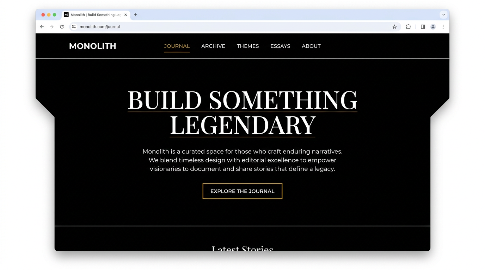
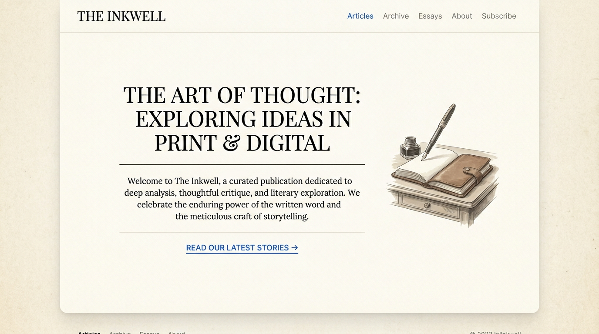
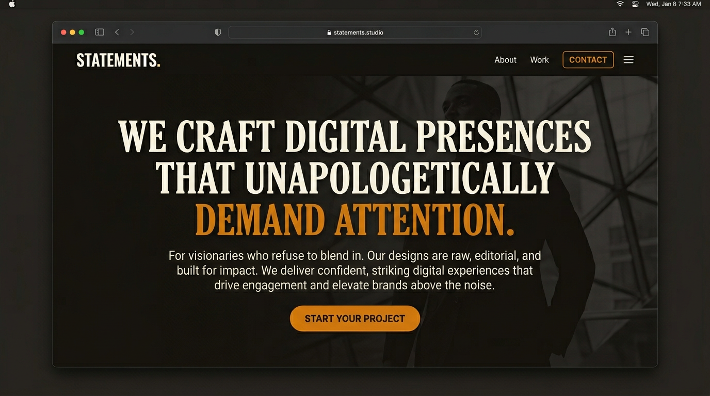
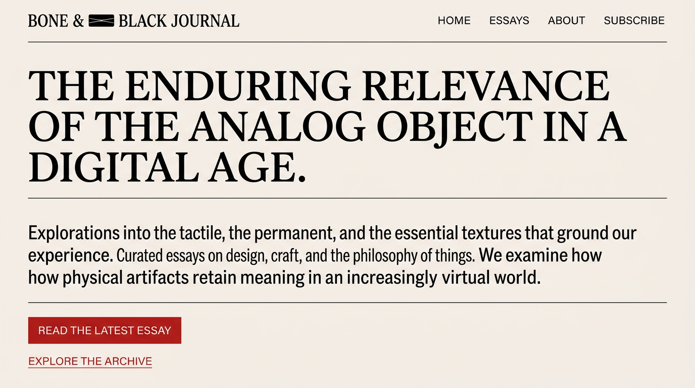
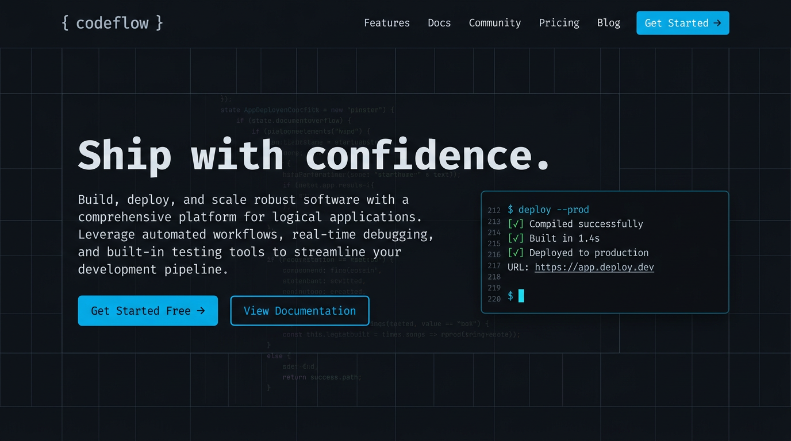

# Website Themes Reference

Themes aligned with logical, elegant, classy aesthetics—favicon-aligned, VC-style, avoiding AI-generated look while remaining striking and bold.

---

## Favicon & Aesthetic Synthesis

**Favicon:** Calligraphic J—dark, almost-black letterform with thin light outline on black. Gothic/refined, confident curves, no flourishes. Mood: class, sophistication, quiet strength, authoritative.

**"Striking, bold, statement" in this context:** Confident restraint, strong typographic presence, editorial clarity—not loud or chaotic. Impact from contrast and form, not saturation.

**Avoid:** Inter, Roboto, Space Grotesk; purple gradients; rigid grids; Features→Pricing→Testimonials flow.

---

## Theme 1: **Monolith**

**Concept:** Pure black/white with one warm accent. Maximum contrast, editorial magazine feel. Favicon-aligned: dark, refined, confident.

| Element | Spec |
|--------|------|
| **Typography** | **Headings:** Fraunces (variable serif, distinctive curves). **Body:** IBM Plex Sans (refined, readable). |
| **Colors** | `#000000` bg, `#ffffff` text, `#e8e4e0` muted, `#c9a227` accent (gold). |
| **Layout** | Single-column, generous margins, content-first. Hairlines and paragraph rules for structure. |
| **Mood** | Premium, editorial, confident. |

**Why it works:** No gradients, no generic sans. Gold accent is restrained and timeless. Strong hierarchy via typography alone.

```css
:root {
  --monolith-bg: #000000;
  --monolith-text: #ffffff;
  --monolith-muted: #e8e4e0;
  --monolith-accent: #c9a227;
}
```

---

## Theme 2: **Slate Editorial**

**Concept:** Dark slate base with crisp white and a single cool accent. Pear Navigator–adjacent: dark gradients (slate/navy), restrained.

| Element | Spec |
|--------|------|
| **Typography** | **Headings:** Source Serif 4 (modern serif, clear). **Body:** Source Sans 3 (clean, professional). |
| **Colors** | `#0f172a` bg, `#f8fafc` text, `#94a3b8` muted, `#22c55e` accent (green). |
| **Layout** | Asymmetric blocks, generous whitespace. Optional narrow sidebar for nav. |
| **Mood** | Calm, logical, trustworthy. |

**Why it works:** Slate + green echoes Pear Navigator’s refined dark theme. Serif/sans pairing is editorial, not startup-template.

```css
:root {
  --slate-bg: #0f172a;
  --slate-text: #f8fafc;
  --slate-muted: #94a3b8;
  --slate-accent: #22c55e;
}
```

---

## Theme 3: **Ink & Paper** *(active)*

**Concept:** Light, paper-like background with deep ink black. Warm cream (Claude-style). Burgundy accent. Black text.

| Element | Spec |
|--------|------|
| **Typography** | **Headings:** Lora (elegant serif). **Body:** Charter (readable, classic). |
| **Colors** | `#faf6f0` bg, `#1a1a1a` text, `#6b6359` muted, `#800020` accent (burgundy). |
| **Layout** | Centered column, max-width ~65ch. Paragraph rules, minimal decoration. |
| **Mood** | Classic, readable, refined. |

**Why it works:** Cream + ink feels like a premium publication. No gradients, no cards. Typography carries the design.

```css
:root {
  --ink-bg: #faf8f5;
  --ink-text: #1a1a1a;
  --ink-muted: #6b6b6b;
  --ink-accent: #2563eb;
}
```

---

## Theme 4: **Charcoal Statement**

**Concept:** Dark charcoal base, high-contrast white, amber accent. Bold headlines, minimal chrome. Favicon’s dark-on-dark with a sharp accent.

| Element | Spec |
|--------|------|
| **Typography** | **Headings:** Playfair Display (dramatic serif). **Body:** DM Sans (geometric, modern). |
| **Colors** | `#1c1917` bg, `#fafaf9` text, `#a8a29e` muted, `#d97706` accent (amber). |
| **Layout** | Large headlines, tight body. Optional full-bleed sections. |
| **Mood** | Bold, editorial, confident. |

**Why it works:** Playfair + DM Sans is distinctive. Amber on charcoal is warm and striking without being loud.

```css
:root {
  --charcoal-bg: #1c1917;
  --charcoal-text: #fafaf9;
  --charcoal-muted: #a8a29e;
  --charcoal-accent: #d97706;
}
```

---

## Theme 5: **Navy Reserve**

**Concept:** Deep navy with soft white and teal accent. Calm, professional, VC-adjacent. Suits portfolios and product pages.

| Element | Spec |
|--------|------|
| **Typography** | **Headings:** Crimson Pro (serif, readable). **Body:** Nunito Sans (rounded but not childish). |
| **Colors** | `#0c1929` bg, `#f1f5f9` text, `#64748b` muted, `#0d9488` accent (teal). |
| **Layout** | Clean sections, clear hierarchy. Optional grid for cards, but not rigid 3-col. |
| **Mood** | Professional, calm, trustworthy. |

**Why it works:** Navy + teal is restrained. Crimson Pro is distinctive; Nunito Sans is friendly but not generic.

```css
:root {
  --navy-bg: #0c1929;
  --navy-text: #f1f5f9;
  --navy-muted: #64748b;
  --navy-accent: #0d9488;
}
```

---

## Theme 6: **Bone & Black**

**Concept:** Off-white (bone) background, pure black text, single red accent. High contrast, editorial, confident.

| Element | Spec |
|--------|------|
| **Typography** | **Headings:** Libre Baskerville (classic serif). **Body:** Karla (geometric sans, crisp). |
| **Colors** | `#f5f0eb` bg, `#0a0a0a` text, `#525252` muted, `#b91c1c` accent (red). |
| **Layout** | Single column, generous line-height. Hairlines and section breaks. |
| **Mood** | Classic, authoritative, striking. |

**Why it works:** Bone + black + red is editorial and bold. No purple, no gradients. Red used sparingly for emphasis.

```css
:root {
  --bone-bg: #f5f0eb;
  --bone-text: #0a0a0a;
  --bone-muted: #525252;
  --bone-accent: #b91c1c;
}
```

---

## Theme 7: **Developer Logical**

**Concept:** Dark code-editor base, terminal/IDE aesthetic. Logical, technical, minimal. Suits dev portfolios, docs, tools.

| Element | Spec |
|--------|------|
| **Typography** | **Headings:** JetBrains Mono or IBM Plex Mono (monospace). **Body:** IBM Plex Sans (readable, technical). |
| **Colors** | `#0d1117` bg, `#e6edf3` text, `#8b949e` muted, `#0ea5e9` accent (cyan) or `#22c55e` (green). |
| **Layout** | Clean sections, optional grid lines, code-block feel. Sharp corners, logical hierarchy. |
| **Mood** | Technical, logical, professional. |

**Why it works:** Monospace + dark bg reads as developer-native. Cyan/green accents are terminal-familiar. No gradients, no generic startup template.

```css
:root {
  --dev-bg: #0d1117;
  --dev-text: #e6edf3;
  --dev-muted: #8b949e;
  --dev-accent: #0ea5e9;
}
```

---

## Image Examples

Visual mockups for each theme (hero sections, typography, color):

| Theme | Image |
|-------|------|
| Monolith |  |
| Ink & Paper |  |
| Charcoal Statement |  |
| Bone & Black |  |
| Developer Logical |  |

---

## Quick Reference: Font Pairs

| Theme | Heading | Body |
|-------|---------|------|
| Monolith | Fraunces | IBM Plex Sans |
| Slate Editorial | Source Serif 4 | Source Sans 3 |
| Ink & Paper | Lora | Charter |
| Charcoal Statement | Playfair Display | DM Sans |
| Navy Reserve | Crimson Pro | Nunito Sans |
| Bone & Black | Libre Baskerville | Karla |
| Developer Logical | JetBrains Mono | IBM Plex Sans |

---

## Tailwind Config Hint

```js
// tailwind.config.js — extend theme
theme: {
  extend: {
    fontFamily: {
      heading: ['Fraunces', 'Georgia', 'serif'],
      body: ['IBM Plex Sans', 'system-ui', 'sans-serif'],
    },
    colors: {
      accent: '#c9a227',
    },
  },
},
```

---

## Implementation Notes

- **Google Fonts:** Import only the weights you need (e.g. 400, 600, 700).
- **Accent usage:** Links, CTAs, small highlights—not large blocks.
- **Whitespace:** Prefer more than less. Let content breathe.
- **Replace Inter:** Update `globals.css` `font-family` when applying a theme.
